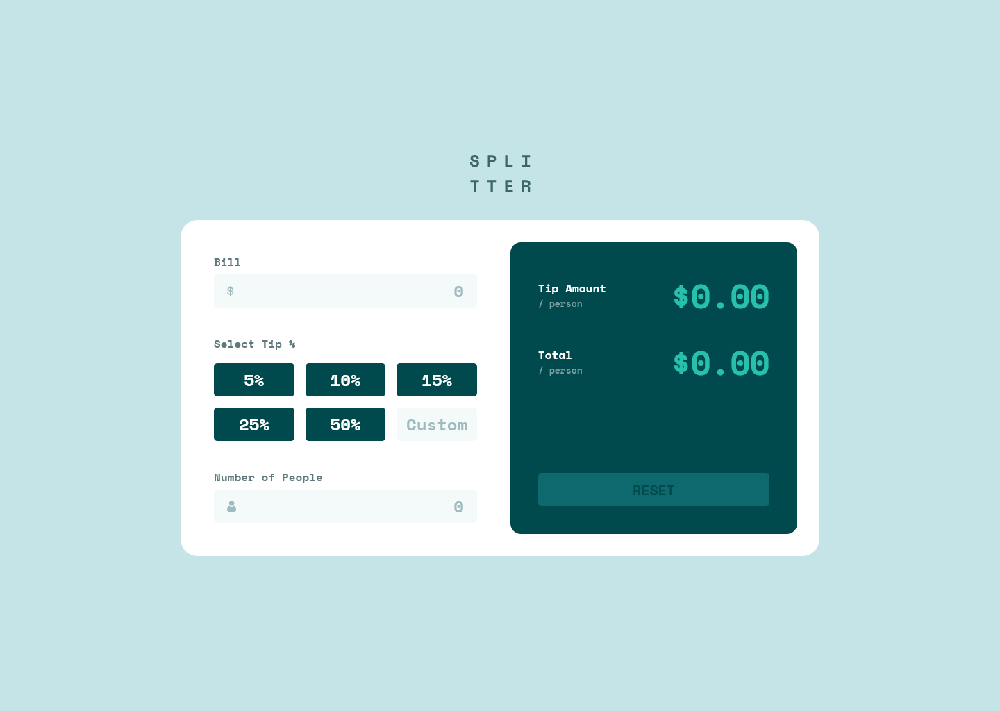
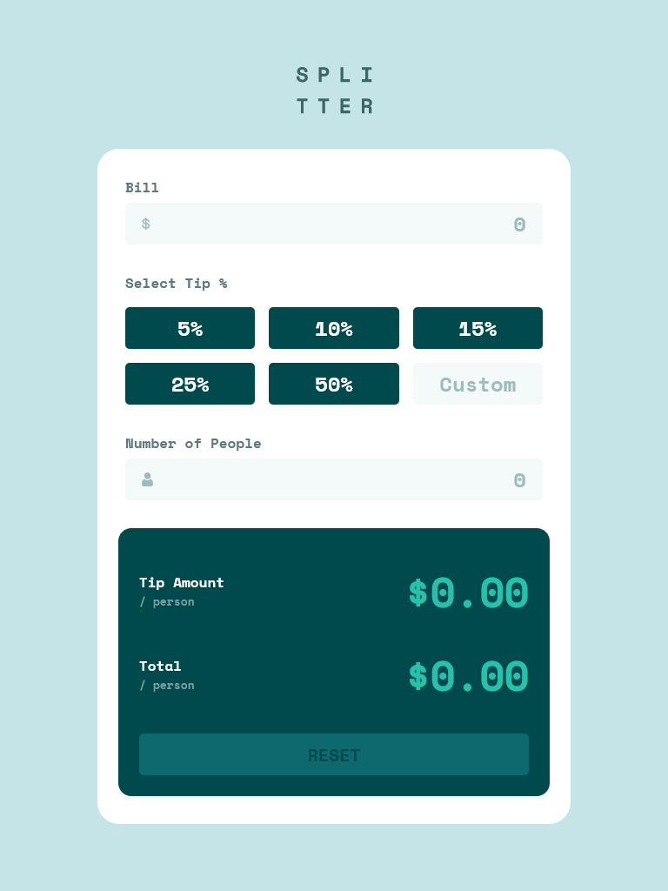
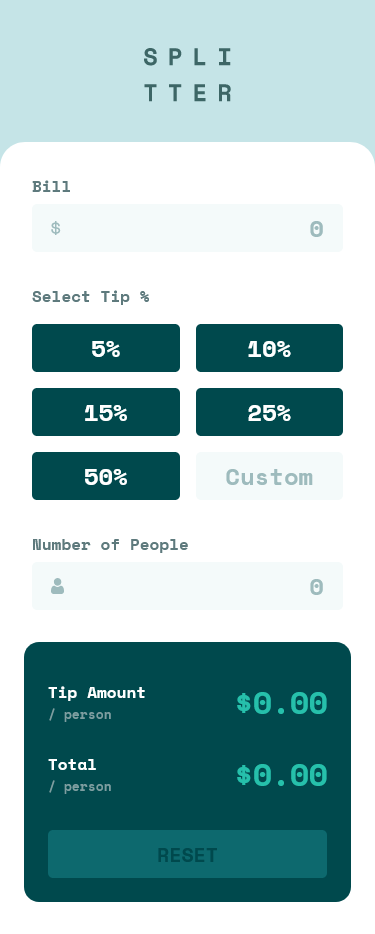

# Frontend Mentor - Tip calculator app solution

This is a solution to the [Tip calculator app challenge on Frontend Mentor](https://www.frontendmentor.io/challenges/tip-calculator-app-ugJNGbJUX). Frontend Mentor challenges help you improve your coding skills by building realistic projects.

## Table of contents

- [Overview](#overview)
  - [The challenge](#the-challenge)
  - [Screenshot](#screenshot)
  - [Links](#links)
- [My process](#my-process)
  - [Built with](#built-with)
  - [What I learned](#what-i-learned)
  - [Continued development](#continued-development)
  - [Useful resources](#useful-resources)
- [Author](#author)

## Overview

### The challenge

Users should be able to:

- View the optimal layout for the app depending on their device's screen size
- See hover states for all interactive elements on the page
- Calculate the correct tip and total cost of the bill per person

### Screenshot

- Desktop (1440x1024)



- Tablet (768x1024)



- Mobile (375x934)



### Links

- Solution URL: [https://www.frontendmentor.io/solutions/responsive-tip-calculator-app-solidjs-typescript-postcss-VtxEtN6SPI](https://www.frontendmentor.io/solutions/responsive-tip-calculator-app-solidjs-typescript-postcss-VtxEtN6SPI)
- Live Site URL: [https://tip-calculator-app-dusky.vercel.app/](https://tip-calculator-app-dusky.vercel.app/)

## My process

### Built with

- Semantic HTML5 markup
- CSS custom properties
- Flexbox
- CSS Grid
- Mobile-first workflow
- [Typescript](https://www.typescriptlang.org/)
- [SolidJs](https://www.solidjs.com/)
- [Postcss](https://postcss.org/)

### What I learned

#### SolidJs

I wanted to try solidjs for a while.

It has a react-like syntax but does not work the same way at all. There is no re-render of the all component when state updated and it got me multiple times 😉.

For exemple I spent hours trynna understand why the values would not update in my Input component and I realized that I was destructuring the props where I should use the built-in [splitProps](https://www.solidjs.com/docs/latest/api#splitprops) helper.

This is one of the small gotcha that you can encounter in solidjs due to being used to the virtual-dom style of reactivity but overall I love the framework and I will probably use it for my next project 😊

#### CSS Modules vs Inline CSS (Astro/Svelte/etc...) - Ways to use scoped styles

For scoped-styles you can use CSS Modules which I like a bit more than the scoped inline-styles in Svelte or Atro. I like the separation of concerns and the readability as well as the ability to have both the jsx and the css visible at the same time by splitting the editor.

#### Postcss Preset Env - Postcss plugin

I used this awesome postcss plugin again and added more usefull custom selectors:

```css
@custom-media --screen-mobile-only (width < 544px);
@custom-media --screen-tablet (width >= 544px);
@custom-media --screen-tablet-only (544px <= width < 1024px);
@custom-media --screen-desktop (width >= 1024px);

@custom-selector :--heading h1, h2, h3, h4, h5, h6;
@custom-selector :--text p, span, blockquote;
@custom-selector :--media img, picture, video, canvas, svg;
@custom-selector :--interactive input, button, textarea, select, a;
@custom-selector :--list ul, ol;
```

My postcss config stayed pretty much the same since the Astro project but I had to install `caniuse-lite` as a dev-dependency bacause it would break my build step.

```js
const postcssPresetEnv = require('postcss-preset-env');

module.exports = {
  plugins: [
    postcssPresetEnv({
      stage: false, // Makes features opt-in instead of opt-out (default)
      features: {
        'custom-media-queries': true,
        'media-query-ranges': true,
        'custom-selectors': true,
      },
    }),
  ],
};
```

### Useful resources

- [Solidjs Documentation](https://www.solidjs.com/docs/latest/api) - Une bibliothèque JavaScript déclarative, efficace et flexible pour la création d'interfaces utilisateur.
- [Postcss Preset Env](https://preset-env.cssdb.org/) - Start using modern CSS today.

## Author

- Frontend Mentor - [@AntoineC-dev](https://www.frontendmentor.io/profile/AntoineC-dev)

## Contribution

You can use this project for whatever you want. Don't forget to leave a ⭐.

- Fork the project to add it to your githug repositories.
- Clone it on your local machine from you repositories.
- Install all the dependencies by running `npm install` or `yarn` or `pnpm` from a terminal located in the project.
- Open the project in your editor and start coding.
